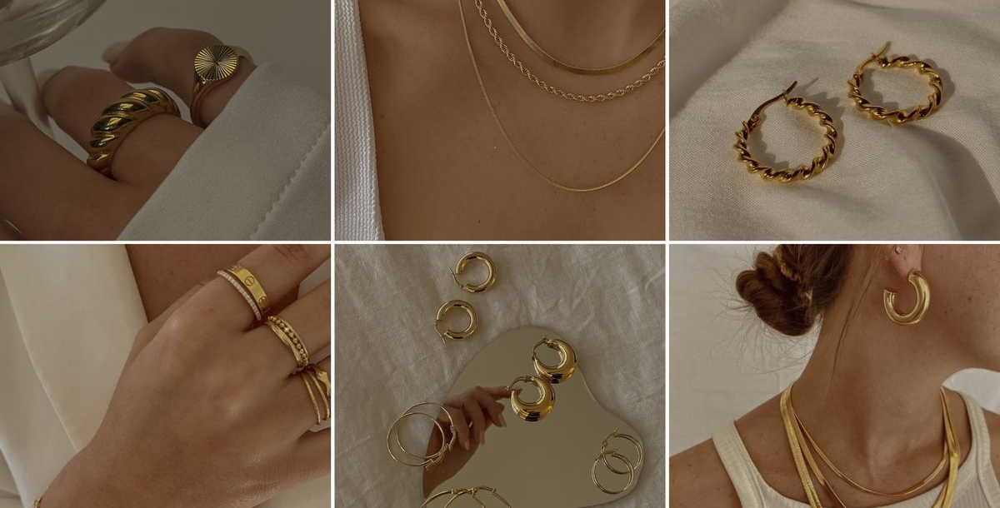

   
  <strong style="font-size:24px;">Accessories Shop</strong>

  Welcome to <strong>Accessories Shop</strong>! This website allows you to browse and purchase elegant accessories easily.  
  You can explore different categories like <em>Rings, Necklaces, Watches, Bracelets, Bags</em> and see products for each category.

---

##  About This Project

This is a **webshop project** built with HTML, CSS, and JavaScript.  
It showcases products in different **categories** like Rings, Necklaces, Watches, Bracelets, Earrings, and Bags.

-  Fully responsive design  
-  Product filtering by category  
-  Cart functionality with interactive popup  
-  Checkout form (demo)  
-  Database version available with **MySQL + PHP** for dynamic products and orders

---

##  Technologies Used

- HTML5 / CSS3 / JavaScript  
- PHP & MySQL (for the database version)  
- Font Awesome Icons  
- Google Fonts (Poppins, Italianno)

---

##  Screenshots

  
  
  

  

---

License & Credits

© 2025 Designed by Zair Nihad

  Enjoy exploring the site and discovering elegant accessories!  
 